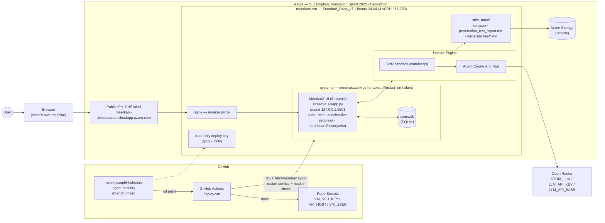

<div align="center">


# MeerkatX

### Unified defense for every agent — ship AI apps that survive contact.

**Built by Team ExtraMile**

[📄 MVP Approval Review deck](docs/ppt/MeerkatX.pdf)

</div>

---

## What this is

AI-built applications can look complete and still ship with holes a read-through
misses. MeerkatX runs independent security engines against a target application
and merges what they find into one clear call: ship, or don't.

It's a front end over a multi-agent, LLM-driven security testing engine — you
give it a target, it dynamically exercises the running application (not just a
static read of the source), and validates what it finds with real
proof-of-concept exploits rather than flagging guesses.

**What gets tested:**

- **Application Security** — can attackers break the app? Authentication,
  secrets, SQL/command injection, misconfiguration.
- **AI Manipulation Testing** — can users manipulate the AI? Indirect prompt
  injection, unsafe tool invocation, data-theft actions, physical/financial harm.
- **Behavioral Validation** — can the AI stay useful and secure? Stateful tool
  use, legitimate task completion, attacker-goal detection, deterministic scoring.

## Try it

A hosted instance is running at:

**https://meerkatx-demo.eastus.cloudapp.azure.com**

Sign up, paste a target URL you're authorized to test, and run a scan. Results
land in your dashboard with cost, findings, and a chat assistant grounded in
that scan's own report.

## Running it yourself

Prerequisites: [Docker](https://docs.docker.com/get-docker/) (running) and an
LLM API key from any OpenAI-compatible provider.

```bash
# Clone and set up the engine
git clone https://github.com/mervinjosephl-hub/MeerkatX-agent-security.git
cd MeerkatX-agent-security
uv sync

# Launch the web UI
uv run --with streamlit --with certifi --with azure-storage-blob streamlit run streamlit_ui/app.py
```

The UI opens at `http://localhost:8501` — sign up, launch a scan, watch it run
live, and browse results and history from the dashboard.

See [`AGENTS.md`](AGENTS.md) for the full CLI reference.

## Architecture



## Configuration

```bash
export STRIX_LLM="openrouter/anthropic/claude-sonnet-5"
export LLM_API_KEY="your-api-key"

# Optional
export LLM_API_BASE="your-api-base-url"   # for a custom/self-hosted endpoint
export STRIX_REASONING_EFFORT="high"      # thinking effort (default: high)

# Optional — archives each completed scan's report to a private Azure Blob
# Storage container ("reports") and reads the History tab back from there
# instead of local disk. Without it, the app works exactly as before.
export AZURE_STORAGE_CONNECTION_STRING="your-connection-string"
```

## Supported models

`STRIX_LLM` accepts any [LiteLLM](https://docs.litellm.ai/docs/providers) model
id (`provider/model`), so any OpenAI-compatible or LiteLLM-supported provider
works out of the box. `vertex_ai/...` and `bedrock/...` need the extra auth
SDKs: `uv sync --extra vertex` / `uv sync --extra bedrock`.

Recommended / tested models:

- **OpenAI** — `openai/gpt-5.6`, `openai/gpt-5.5-pro`, `openai/gpt-5.5`,
  `openai/gpt-5.4`, `openai/gpt-5.3-codex`
- **Anthropic** — `anthropic/claude-fable-5`, `anthropic/claude-opus-5`,
  `anthropic/claude-opus-4-8`, `anthropic/claude-sonnet-5`,
  `anthropic/claude-sonnet-4-6`
- **Google** — `vertex_ai/gemini-3.1-pro-preview`,
  `gemini/gemini-3.1-pro-preview`, `gemini/gemini-3.6-flash`
- **DeepSeek** — `deepseek/deepseek-v4-pro`, `deepseek/deepseek-v4-flash`
- **Qwen (DashScope)** — `dashscope/qwen3.8-max`,
  `dashscope/qwen3.7-max-2026-06-08`
- **Kimi (Moonshot)** — `moonshot/kimi-k3`, `moonshot/kimi-k2.7-code`

Using a model outside this list still works — Strix just prints a one-time
quality warning at startup rather than blocking the run. If you're on a
ChatGPT subscription rather than an API key, use `STRIX_LLM=chatgpt/<model>`
(see `strix auth login`).

## Contributing

Issues and pull requests are welcome — this started as a hackathon build and
is still actively evolving.

---

> [!WARNING]
> **Authorized use only.** MeerkatX actively tests the targets you point it
> at, so only run it against systems you own or have **explicit, written
> permission** to test, and stay within the agreed scope. Unauthorized testing
> is illegal in most jurisdictions. You alone are responsible for obtaining
> authorization and complying with the law. Provided "as is" with no warranty
> or liability for misuse.
